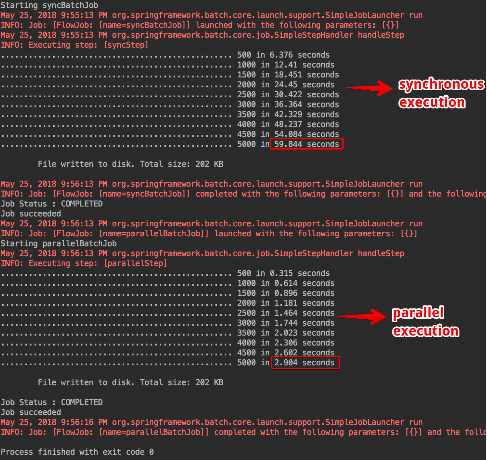

# Spring Batch with parallel processing

This is a simple example of a Spring Batch job running in parallel, leveraging the **Multi-Threaded step with synchronized reader** strategy.

## Running the application
1. `mvn install`
2. execute `experiments.sync.App` 

An example of output we get from executing App:



As we can see, parallel execution is much, much faster than the async version.

## How to make a sync job parallel

It's super easy. There are only 2 simple steps:

### 1. Configure the tasklet to run with a TaskExecutor

```
<bean id="taskExecutor" class="org.springframework.core.task.SimpleAsyncTaskExecutor"/>
    
<batch:tasklet
        task-executor="taskExecutor"
        throttle-limit="20">
    <batch:chunk
            reader="basicItemReader"
            processor="compositeProcessor"
            writer="basicItemWriter"
            commit-interval="10">
    </batch:chunk>
</batch:tasklet>
```
### 2. Make the Reader's read method synchronized
```
@Override
public synchronized Item read() throws ItemReaderException {
    return items.poll();
}
```

## Resources
- https://docs.spring.io/spring-batch/4.0.x/reference/html/scalability.html


